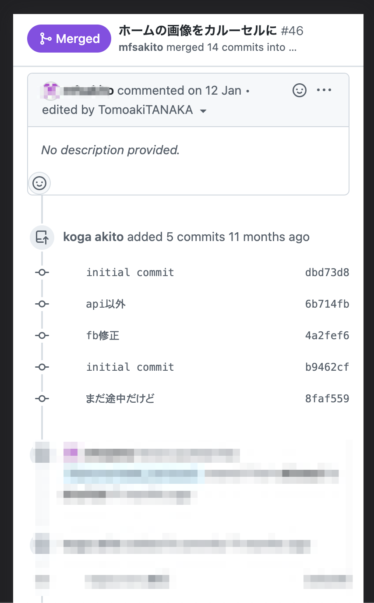
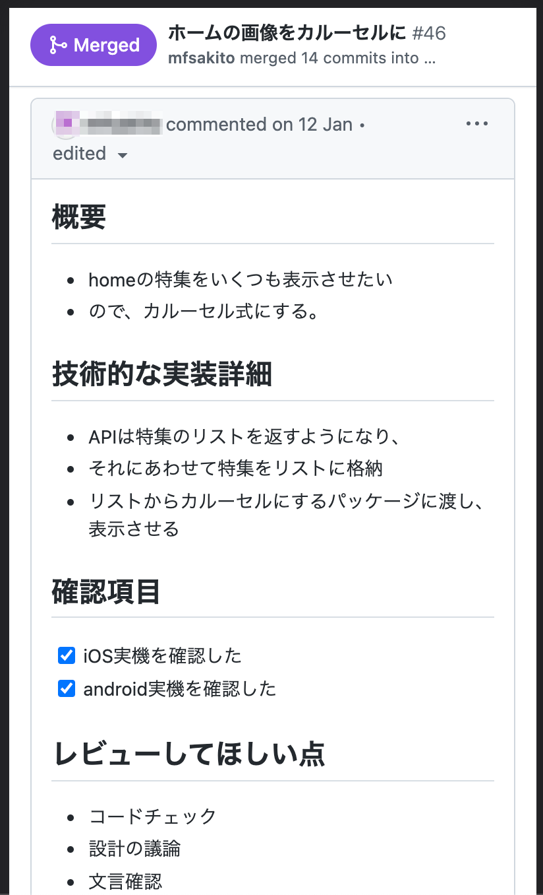

<!-- コメント：画像を中央に配置する centerコマンドを有効に -->
<style>
img[alt~="center"] {
  display: block;
  margin: 0 auto;
}

</style>

# コードレビューのススメ@株式会社インプローブ勉強会

## 2021/12/03 TomoakiTANAKA

---

# 自己紹介

---

# 田中智章


- 富岡市出身
- 群馬工業高等専門学校を卒業後、他県の大学院を経て就職
- SE としてキャリアを始め、現在は事業会社勤務
- 主に Web、時々アプリ開発（Rails や Flutter）
- ウィスキーと LEGO が好き

---

# 会社紹介

---

# 株式会社エバーセンス


## Vision

- 家族を幸せにすることで、笑顔溢れる社会をつくる。

## Products

- 妊婦さんへの情報提供をする「ninaru」
- 子育てに必要な情報や機能満載の育児アプリ「ninaru baby」

---

# 本日の勉強会について

---

# 本日の勉強会について

そもそもなぜコードレビューが必要なのか？からはじめ

レビュー「される側」・「する側」それぞれで、
どういった点に気をつけるとより良いコードレビューになるかを説明します。

<br>
また、かんたんに僕（及び周辺）で実践している内容も紹介します。

明日からのコードレビューに何か活かせるものをお話できればと思っています。

---

# 目次

---

# 目次

コードレビューに関して、下記の内容をお話します。

1. 目的
2. 心得（される側）
3. 心得（する側）
4. 事例紹介
5. まとめ

---

# コードレビューの目的

---

# Q. <br><br>コードレビューの目的は一体なんでしょうか？<br>わざわざ時間をとってやる意味は何でしょうか？

---

# コードレビューの目的

## コード（≒ プロダクト）の品質を高めるため

- 仕様を満たしているかの検証
- コードでレベルで不具合がないかの検証
- その他
  - 拡張性 / セキュリティ / パフォーマンス / トランザクション、etc

## メンバーの技術力を底上げするため

- 良いコードの認識を揃える
- フィードバックを通じた育成

---

# Q. <br><br>コードレビューを実りあるものにするには？

# A. <br><br>レビューされる側 / する側 双方に心構えや準備が必要（個人的には、される側の準備が最も大切）

---


---

# 世の中の情報の多くはレビューする側（こういった視点でコードを書いてください）というものが中心

---

# この勉強会では、「レビューされる側」・「する側」双方の視点で、注意している点をお話しします。

---

# レビューの心得（される側）

---

# レビューの心得（される側）

1. 何はともあれセルフレビュー
2. 何をレビューしてもらいたいのか明確に
3. フィードバックは素直に受け入れよう
4. フィードバックは人格否定ではないと理解する
5. 対応しないフィードバックがあれば、理由を述べる

---

# 1. 何はともあれセルフレビュー

## Bad

エンジニア：

- 「よし、コード作成完了。一通り動いたのでレビューに出そう」

レビュワー：

- 「デバックコメントも残ってるなぁ。print 文もあるし...このコードは、レビュー以前の問題では？」

---

# 1. 何はともあれセルフレビュー

## Good

エンジニア

- 「よし、コードつくれた。まずは自分の PR を確認しよう」
- 「あ、デバックコメント残っているな。消しておこう」
- 「一通りセルフチェックはしたので、レビューに出そう」

レビュワー：

- （一通り見て）「特にパットみ変なところはないな。詳細見よう」

---

# 1. 何はともあれセルフレビュー

## 一通り動いて嬉しいのはよくわかりますが、その時点でのクオリティが高いことは稀です

## デバックコード残りやタイポの発見、より良い変数名やメソッド化などの検討などなど。

## 一旦立ち止まって、自分のコード確認をぜひに！！

---

# 2. 何をレビューしてもらいたいのか明確に

## Bad



エンジニア：

- 「よし、コード作成完了。先輩、レビューお願いします:smiley:」

レビュワー：

- 「うーん、突っ込みは沢山あるけど...どんなフィードバックを期待してるのかなぁ？」

---

# 2. 何をレビューしてもらいたいのか明確に



## Good

エンジニア

- 「よし、コード作成完了。概要やレビューしてもらいたい点を PR に書いて、っと。先輩、レビューお願いします:smiley:」

レビュワー：

- 「OK。そしたら ●● という観点メインでレビューするね」

---

# 2. 何をレビューしてもらいたいのか明確に

## コードレビューする側は、仕事の背景を全部理解しているわけではありません

## コードの書き方なのか、動作チェックなのか、パフォーマンスやセキュリティなのか、でコードチェックの観点が変わります

## どんな観点でチェックしてほしいか、自分がどんなコードを書いたのか、簡単に PR に書きましょう

---

# 3. フィードバックは素直に受け入れよう

---

# 3. フィードバックは素直に受け入れよう

## Bad

レビュワー：

- 「このプロジェクトでは ●● というアーキテクチャなので、このコードを xxx という風に直してください」

エンジニア：

- 「動いているし、前の PJ では指摘なかったし無視でいいや」

レビュワー：

- 「指摘事項が修正されていないなぁ。フィードバックしても無駄なのかな...」

---

# 3. フィードバックは素直に受け入れよう

## Good

レビュワー：

- 「このプロジェクトでは ●● というアーキテクチャなので、このコードを xxx という風に直してください」

エンジニア：

- 「承知しました！（前の PJ では指摘なかったけど、この PJ では指摘あるんだな、ふむふむ）」

---

# 3. フィードバックは素直に受け入れよう

## フィードバックを 真摯に受け止めましょう

## 特に初学者や参加したての PJ では、まず話をききましょう。

## あるいは、勝手に無視せずきちんと議論しましょう

##### （ピックアップした事象がちょっと悪いです）

---

# 4. フィードバックは人格否定ではないと理解する

---

# 4. フィードバックは人格否定ではないと理解する

## Bad

レビュワー：

- 「A 機能、B 機能、C 機能、それぞれ xxx という観点で修正をお願いします。」

エンジニア：

- 「ぁあ、また沢山指摘をもらってしまった。（何だか自分のスキルが足りない点を否定されているようだ...）」

---

# 4. フィードバックは人格否定ではないと理解する

## Good

レビュワー：

- 「A 機能、B 機能、C 機能、それぞれ xxx という観点で修正をお願いします。」

エンジニア：

- 「ぁあ、また沢山指摘をもらってしまった。（とはいえ、コードの品質が高くなるので、しっかり修正していこう）」

---

# 4. フィードバックは人格否定ではないと理解する

## フィードバックは、人でなく、「モノ・コト」に向かっている

## 確かに、指摘が多いと凹むこともあるが、自分とコードは切り離して考えると良い

## なお、フィードバックする側に関しては後述

---

# 5. 対応しないフィードバックがあれば、理由を述べる

---

# 5. 対応しないフィードバックがあれば、理由を述べる

## Bad

エンジニア

- 「よし、コード作成完了。概要やレビューしてもらいたい点を PR に書いて、っと。先輩、レビューお願いします:smiley:」

レビュワー：

- 「OK。そしたら ●● という観点メインでレビューするね」

---

# 5. 対応しないフィードバックがあれば、理由を述べる

## Good

エンジニア

- 「よし、コード作成完了。概要やレビューしてもらいたい点を PR に書いて、っと。先輩、レビューお願いします:smiley:」

レビュワー：

- 「OK。そしたら ●● という観点メインでレビューするね」

---

# 5. 対応しないフィードバックがあれば、理由を述べる

## ほげほげ

## ほげほげ

---

# レビューの心得（する側）

1. info / want / must などで指摘のレベルを明確に
2. どんな観点でレビューしているか明確にする
3. 論理的にフィードバックする
4. 人格否定はしない
5. 自分のことを棚にあげて、コードに向き合う

---

# 1. info / want / must などで指摘のレベルを明確に

## Bad

```ruby
def get_user_name
  return 'tanaka'
end
```

```
rubyでは「get」をつけないので、外したほうがいいです
```

---

# 1. info / want / must などで指摘のレベルを明確に

## Good

```ruby
def get_user_name
  return 'tanaka'
end
```

```
[must]
rubyでは「get」をつけないので、外したほうがいいです
```

---

※以下、テーマに沿って「Bad / Good」を説明します（繰り返し）

---

# コードレビュー事例

実際に実施している事例を紹介します

- **セルフレビュ―**
  - かんたんでもいいので、テストケースを作成。一通り流す。
- **レビュー負担低減**
  - リファクタする際に専用の PR を作成する
- **デザイン系**
  - css や xib ファイルのレビューは困難なので仮組みですすめ、最終デザイナチェック
- **その他**
  - コードスタイルはコード書く以前に決めておく
  - 設計（アーキテクチャ、DB、ディレクトリ構成など）も事前に

---

# テストケースの例

- かんたんにテストケースを作成（あくまで自分用）。
- コードチェック後、順番に実施。NG でコードを修正したら、1 からやり直す


---

# ●● の例

いくつか実例を写真つきで紹介

---

# まとめ

---

# ※ 最後にまとめをいれます ※

---

# 質疑応答

---

# おわり
