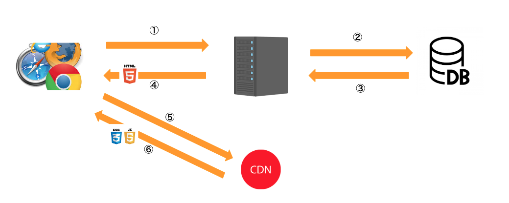
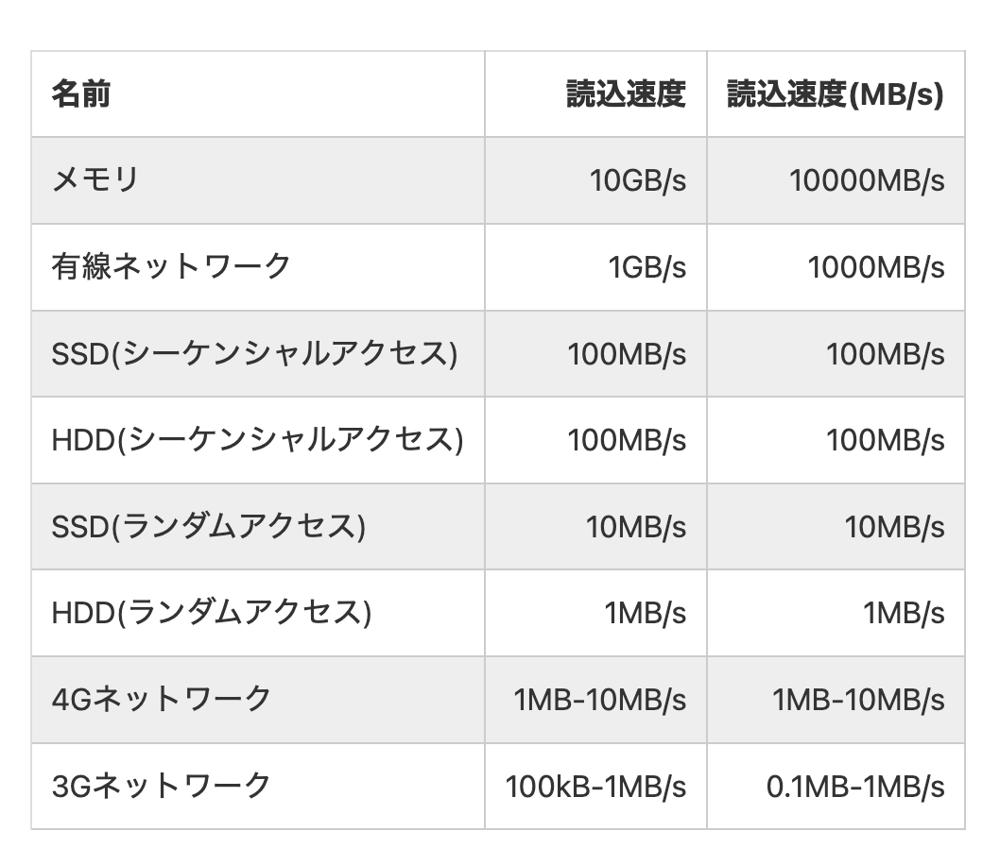
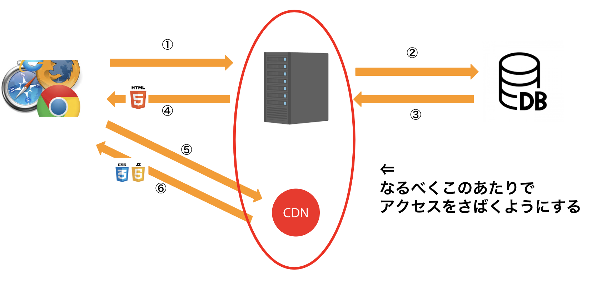

<style>
img[alt~="center"] {
  display: block;
  margin: 0 auto;
}

</style>

# 数千万PVをさばくためのインフラ構成について

## 2022/06/08 TomoakiTANAKA

---

# 自己紹介

---

# 田中智章


- 富岡市出身
- SE としてキャリアを始め、現在は事業会社勤務
- 主に Web開発 を担当、時々アプリ開発（Rails / Flutter / Unity ← New）
- 好きなお酒はウィスキー全般、あと LEGO が好き

---

# 宣伝

---

# 会社/プロダクト紹介

---

# 株式会社エバーセンス


## Vision

- 家族を幸せにすることで、笑顔溢れる社会をつくる。

## Products

- 妊婦さんへの情報提供をする「ninaru」
- 子育てに必要な情報や機能満載の育児アプリ「ninaru baby」

---

# 株式会社DanRan


- エバーセンスとポプラ社のJV
- 2022年4月設立
- 主に、児童向けの知育アプリの開発等を行う

## Products

- タッチであそぼ！あかまるどれかな？
- iOS / Android 版があるので是非


---

# アイスブレイク

- Q1. PVってなんのことでしょうか？（なんの略でしょうか）
- Q2. Webメディアってなんでしょうか？
- Q3. 月間PV 4,500万ってすごいのでしょうか？

是非スレッドに回答をお願いします

---

# アイスブレイク シンキングタイム

---

# アイスブレイク（回答）

- A1. PVはPageView（ページビュー）の略で、Webページの閲覧回数のこと
- A2. www（WorldWideWeb）上で、記事をまとめた読めるWebサイト（Webサービス）のこと
  - 例）Qiita, zenn, マイナビニュース, ロケットニュース24

---

# アイスブレイク（回答）

- A3. 月間PV 4,500万ってすごいのでしょうか？
  - 月間平均で 1,000pv/分 なので、結構すごいと思います
  - GoogleAnalyticsのリアルタイムユーザー 3,000人 くらいです（でした）
  - もちろん上を見たらきりがないですが…
    - 例）Yahoo!ニュース 225億PV/月・zozoタウン 5億PV/月

出典：
- [1つの記事で世の中が大きく変わる――1日の記事数約6000本、月間225億PVを数える「Yahoo!ニュース」のこれまでとこれから](https://about.yahoo.co.jp/hr/linotice/20200825.html)
- [通販新聞 【ZOZOテクノロジーズの久保田社長に聞く　「ウェア」の現状と成長戦略は?㊤】　中国でも「ウェア」が武器に、お手本コーデで差別化図る](https://www.tsuhanshimbun.com/products/article_detail.php?product_id=4763&_ssd=1#:~:text=%E3%82%BE%E3%82%BE%E5%AD%90%E4%BC%9A%E7%A4%BE%E3%81%AEZOZO%E3%83%86%E3%82%AF%E3%83%8E%E3%83%AD%E3%82%B8%E3%83%BC%E3%82%BA,%E3%81%AB%E6%8B%A1%E5%A4%A7%E3%81%97%E3%81%A6%E3%81%84%E3%82%8B%E3%80%82)

---

# 本日の勉強会について

---

# 本日の勉強会について

中規模「Webメディア」を効率的に運営する方法に関して、考えや知見をお話します。

あくまで田中個人の知見や経験によるものですので、取り扱いにはご注意ください。
掲載内容は私自身の見解であり、必ずしも所属する企業や組織の立場、戦略、意見を代表するものではありません。

---

## 話すこと

- 数百万〜数千万PVのWebメディアを、できるだけ安いインフラ構成でさばくための考え方
- 下記のシステム構成を前提にした話をします
  - サーバーサイドレンダリングを前提としたシステムにおける
  - AWSを前提としてインフラ構成（多分GCPやAzuleでも通用する考え）

## 話さないこと

- ECサイト等、WebメディアではないWebサービスの大規模トラフィックをさばく技術
- オンプレ前提としたインフラ環境における構成
- 具体的なプライシングやインスタンス構成

---

## この話を聞いて得られそうなこと

- Webサービスの運用を見据えたインフラ構成やテクニックの理解
- テレビCMやインフルエンサーバズによる急なアクセス増加に対する心の安寧<br />
（個人差あり）


---

# 目次

---

# 目次

1. Webメディアの特徴と構成技術の分解
2. キャッシュを使ってアクセスをさばく（事例紹介）
3. まとめ

※ 組織の意見でなく、個人の意見です

---

# Webメディアの特徴

---

# Webメディアの特徴

- 誰が見てもほぼ同じ構成
  - 記事はだれが見てもほぼ同じ
  - 広告やレコメンドはユーザーによって異なる
- 技術的に分解すると…
  - 記事はだれが見てもほぼ同じ（HTML / CSS 部分）
  - 広告やレコメンドはユーザーによって異なる（JavaScript部分）
  - 読者にとっては、HTTPのGET中心の世界（データを取得するのが主）

--- 

# Webメディアの特徴（もう少し技術的に）



※ サーバーサイドレンダリングを前提にしています


- ①：ブラウザからWebサーバーへリクエストがはいる
- ②③：サーバーは必要に応じて、DBへアクセス。データを取り出す
- ④：サーバーは、テンプレートエンジン等を使ってHTMLを作成、ブラウザに返す
- ⑤⑥：ブラウザはHTMLを解釈、必要に応じてcssやJavaScriptをCDN問い合わせ
- ⑦：ブラウザが描画

---



出典
- [プログラマが知っておくべき、メモリ/ディスク/ネットワークの速度まとめ](https://qiita.com/awakia/items/c8ada6c8101efe2de561)

---

# どこがボトルネックになるか？

ボトルネック
- お値段：（高い）DB（例：RDS）> Webサーバー（例：EC2）（安い）
- お値段：（高い）メモリ > HDD（安い）
- 転送速度：（高速）メモリ > HDD > ネットワーク（低速）

---

# ボトルネック解消をどのように考えるか？

- できる限りWebサーバー側でリクエストをさばく
- できる限りWebサーバーも、メモリやHDDを減らしたい（安くなるから）

```
ボトルネック
- お値段：DB（例：RDS）> Webサーバー（例：EC2）
- お値段：メモリ > HDD
- 転送速度：メモリ > HDD > ネットワーク
```

---

# ボトルネック解消をどのように考えるか？



---

# キャッシュを使ってアクセスをさばく（事例紹介）

---

# キャッシュとは？

キャッシュは、CPUのバスやネットワークなど様々な情報伝達経路において、ある領域から他の領域へ情報を転送する際、その転送遅延を極力隠蔽し転送効率を向上するために考案された記憶階層の実現手段である。実装するシステムに応じてハードウェア・ソフトウェア双方の形態がある。

↓↓↓

- よく使うデータやファイルを、アクセスしやすいところにおいておく
  - 例）アクセスしやすい = 高速に取り出せる場所（メモリやローカルファイル）
- 逆にあまり使わないファイルは、必要なときに取り出す
  - 例）必要なときにネットワーク経由で取り寄せる

出典：
- [キャッシュ](https://ja.wikipedia.org/wiki/%E3%82%AD%E3%83%A3%E3%83%83%E3%82%B7%E3%83%A5_(%E3%82%B3%E3%83%B3%E3%83%94%E3%83%A5%E3%83%BC%E3%82%BF%E3%82%B7%E3%82%B9%E3%83%86%E3%83%A0))


---

# Webメディアによるキャッシュ戦略

- よく使うファイル
 - クエリなしのURLに対するHTMLファイル
 - CSSやJavaScriptなど、共通でアクセスするファイル
- あまり使わないファイル
  - クエリパラメータ付きのURL（検索やページネーション）
  - GET以外のリクエスト

---

# Webメディアによるキャッシュ戦略

- クエリなしのURLに対するHTMLファイル 
  - => WebサーバーでHTMLファイルを事前作成（ファイルキャッシュ）
- CSSやJavaScriptなど、共通でアクセスするファイル
  - => CDNで高速アクセスできるようにしておく（S3 + CloudFront）

---

# ファイルキャッシュの運用事例

---

# 運用例 / 設定例（キャッシュの作成、削除）
## コーポレートサイトのようなアクセスが少ないサイトの場合

- キャッシュの作成
  - Webサーバーのデフォルト機能を使う（アクセス時にキャッシュ生成）
- キャッシュの削除
  - 記事公開 / サイト全体の更新時（css変更など）
  - まとめてファイルを消す

---

まとめ
- コーポレートサイトのようなアクセスが少ないサイトの場合は、ざっくり管理
- 例えばWordPressには、まとめてファイルキャッシュを削除してくれるようなプラグインがあるのでそれを利用する

---

# 運用例 / 設定例（キャッシュの作成、削除）
## Webメディアのようにアクセスが多いサイトの場合

- キャッシュの作成
  - Webサーバーのデフォルト機能を使う（アクセス時にキャッシュ生成）
- キャッシュの削除
  - 記事公開
    - => 記事のURL、関連ページを個別に削除して作り直し
  - サイト全体の更新時
    - => URL一覧を取得して、数十〜数百ページ単位でキャッシュを作成

---

まとめ
- 常時アクセスが多いサイトだと、一度にファイル削除はキャッシュが薄くなるので危険
- キャッシュ生成や削除の部分は、基本手作り

---

# 運用例 / 設定例（キャッシュさせる / させない）

- とはいえ全部のファイルをキャッシュさせてしまうと運用上困る
  - 例）編集者が記事を更新したのに最新版が反映されない（確認できない）
  - 例）sitemapなど、リアルタイムでGoogleに伝えたいものが、古いままだと困る

---

```bash
set $do_not_cache 0;

# WordPressの管理画面にログインすると付与されるcookieを持っていたらキャッシュなしにする
if ($http_cookie ~* "wordpress_(?!test_cookie)|wp-postpass_" ) {
    set $do_not_cache 1;
}

# GET以外はキャッシュなしにする
if ($request_method != GET) {
    set $do_not_cache 1;
}

# sitemapなど特定のURLはキャッシュなしにする
if ($request_uri ~* "(sitemap.xml") {
    set $do_not_cache 1;
}
```

---

# CDNの話

---

基本的に、assetファイル（画像やcss等）をファイルサーバーに配置し、CDN登録するだけ
とはいえ、トラブルも…

- 例）画像ファイル更新したのに、更新されない
- 原因
  - S3のファイルは変更されているが、CDNのキャッシュが残るため
- 対策
  - フィンガープリントを使ってデプロイのたびにファイル名を書き換える
  - CDNのキャッシュを削除する

フィンガープリントの例
```
app.css
↓↓↓
app-98f2b4256f620be0496ff18f157f863a.css
```

---

# まとめ

---

# まとめの前に

- Q. 
  - そもそもGET中心でいいなら、HTMLファイルごとCDN配信すればよいのでは？
- A. 
  - まさしくそのとおり
  - 最近のミニサイトであれば、ローカルでHTMLを作成して、s3にアップロード => CDN配信の形もおすすめです
  

---

# まとめ

- Webメディアの特徴を説明しました
  - GET中心の世界
- Webメディアにおけるアクセスのさばき方を説明しました
  - 基本はファイルキャッシュ
- ファイルキャッシュやCDNの具体的な運用について説明しました  

---

# ご清聴ありがとうございました

---

# 質疑応答

---

# おわり
