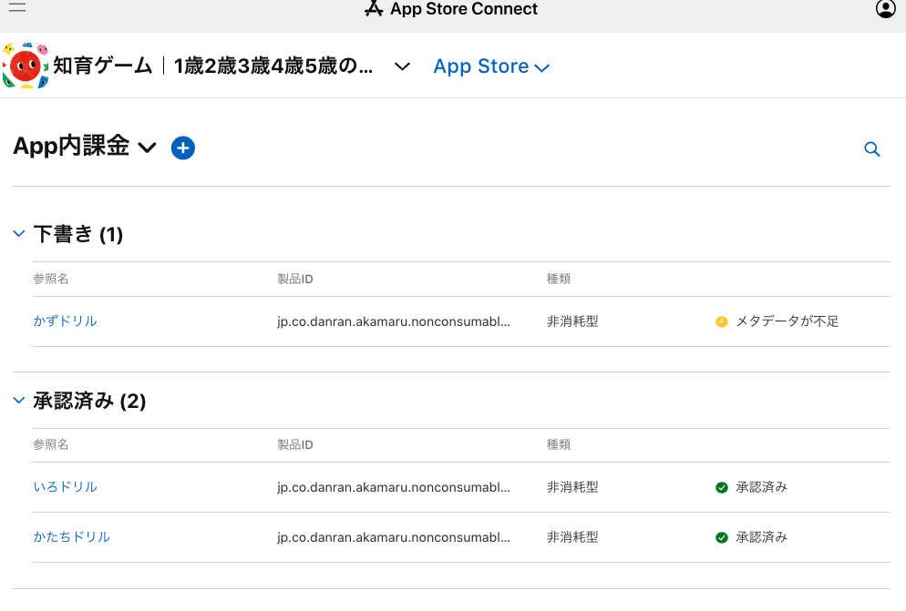

<style>
img[alt~="center"] {
  display: block;
  margin: 0 auto;
}

</style>

# Unityで課金処理を実装する際のTips

2023.06.30 TomoakiTANAKA

---

<!--
_header: "**グループ勉強会資料** __Unityにおける課金処理（In-App Purchase）を実装する__"
_footer: "by [TomoakiTANAKA](tanaka1987＠gmail.com)"
-->

# 自己紹介

---

# 田中智章


- 群馬県富岡市出身
- SEでキャリアを開始
  - 金融、製造etc
- 現在は株式会社DanRan
- 好きなもの
  - ウィスキー、LEGO、ぷよぷよetc

---

# 会社紹介

---


---


# 株式会社DanRan

## Vision
### こどもたちが自由に人生を歩む社会をつくる

## Products
### タッチであそぼ！あかまるどれかな？

---

# スキル紹介
## 相談にのれそうなスキル

---
<style scoped>
  table { 
    table-layout: fixed;
    width: 100%;
    display:table;
    font-size: 24px;
  }
</style>

# （相談にのれそうな）スキル紹介

|分類|技術スタック|備考|
|:---:|:---:|:---:|
|Web|Ruby on Rails / Next.js / WordPress / API開発|最近はそんなにやってない|
|アプリ|Unity（2Dゲーム）、Unity課金|今日話すテーマ|
|その他|機械学習のベース（数学）の話|大学で研究していたので|
|その他|エンジニア採用全般|エバーセンスでの実績あり|
|その他|BigQueryによる分析、SEO|非エンジニア向けかも|

---

# 本題

---

# Unityで課金処理を実装する

- 大雑把な実装の流れを説明します
- 課金処理の不正を防止するための方法（レシート検証）を説明します
- iOS / Android / その他 つまづきを紹介します

---

# Unityで課金処理を実装する大まかな流れ

```
// ① iOS / Android で商品情報を定義する
// ② Unity上から、①にアクセスして商品情報を取得する
// ③ 商品を購入する（購入すると、現実世界のようにレシートが発行される）
// ④ 不正防止のため、レシートが正しいかどうかを確認する
// ⑤ 不正がなければ、商品データを付与する
```

- ①は各種ストア
- ②〜③はUnity標準ライブラリ（Unity IAP）を使うのがデファクト
- ④は、アプリで行う / サーバーで行うの2通りがある
  - 詳細は後ほど

---

## ① iOS / Android で商品情報を定義する
- アプリと同じで商品データそのものにも申請が必要なので注意




---

# ②③商品データの取得と、商品の購入

Unityの資料が色々あるので調べてみてください
ネットワーク不良などの事前チェックのほうが大変…

---

## ④⑤ レシート検証〜商品データの付与

- 簡単にやるにはアプリでチェック
  - ただし、不正検知やCS対応（買った、買ってない）が判断しにくい
- サーバーでやることが多い
  - 自前（PIBO方式）
  - Baasを使う（MicrosoftのPlayfabやRevenueCatなど）
- DanRanでは、Playfabを採用
  - Minecraftでも利用されている、ランキングやガチャ、お知らせなども
  - 商品データなども管理できるので、アプリはそのデータを読み取り同期
  - 「サブスク」の自動更新検知がないのが弱み（ストアと同期するコードを書く必要あり）

---

# iOSやAndroid特有のつまずきポイント

---

# iOSやAndroid特有のつまずきポイント

- iOSは絶対にsandboxユーザーを作成してテストする
  - 購入のテストはしにくい、データを取り消しにくい
  - 課金自体を実装することは少なく、手探りになるので、購入データがバグりやすい
  - 本番アカウントは、購入データが消せないのでやっかい
- sandboxユーザーは一度もAppleID登録してないユーザーである必要がある
  - 捨て垢を用意しよう
- サブスクの自動更新は5分*6セットなどと書いてあるが、回数は必ず一定ではない
- Androidにはsandboxユーザーという概念はない。購入自体を取り消すことができる。
  - ただし同一アカウントで、2〜3回購入を取り消すと、二度と消せなくなる 

---

# まとめ

- Unityで課金を行う場合は、「UnityIAP」ライブラリを使う
- レシート検証はサーバでやる
  - （個人開発 + サブスクなら）Revenucatが良い。法人でやるレベルだと手数料3%が痛い
  - （個人開発 + 買い切りなどサブスク以外もやるなら）Playfabがおすすめ。10万ユーザーまで無料
- とにかく本番アカウントでのテストを遅らせる

---

# ご清聴ありがとうございました

---

# 質疑応答

---

# おわり
